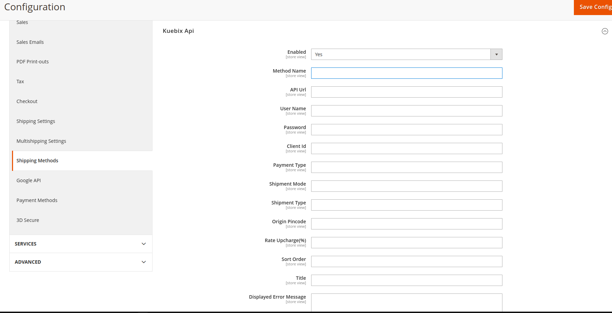
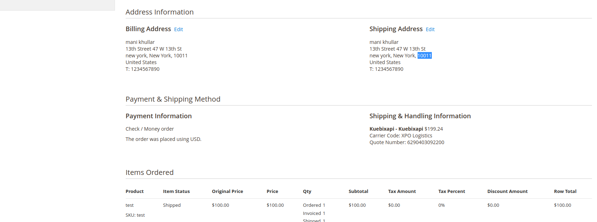
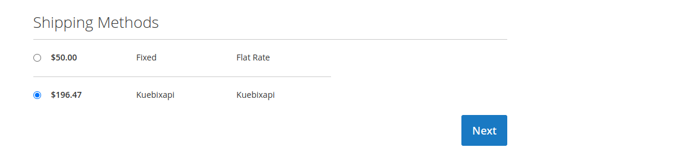
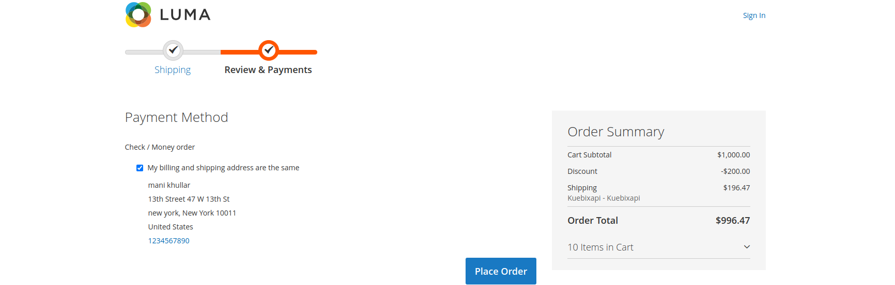

# Module Bluethinkinc Kuebix

    ``Bluethinkinc/module-kuebix``

 - [Main Functionalities](#markdown-header-main-functionalities)
 - [Installation](#markdown-header-installation)
 - [Configuration](#markdown-header-configuration)
 - [Order view page](#markdown-header-order-view-page)
 - [Shipping page](#markdown-header-shipping-page)
 - [Payment page](#markdown-header-payment-page)

## Main Functionalities
Bluethinkinc@copyright

## Installation
\* = in production please use the `--keep-generated` option

### Type 1: Zip file

 - Unzip the zip file in `app/code/Bluethinkinc`
 - Enable the module by running `php bin/magento module:enable Bluethinkinc_Kuebix`
 - Apply database updates by running `php bin/magento setup:upgrade`\*
 - Compilation by running php bin/magento setup:di:compile
 - Static content deploy by running php bin/magento setup:static-content:deploy
 - Flush the cache by running `php bin/magento cache:flush`

## Configuration

 - We can configure the kubix api from the configuration. Go To (Magento Admin -> Store-> Configuration -> Sales -> Shipping methods -> Kuebix Api) 
 

## Order view page

 - We can see the kubix shipping method in admin sale order view page. Go To (Magento Admin -> Sales -> Order) 
 
 
## Shipping page

 - We can see the kubix api on checkout shipping page. 
 

## Payment page

 - We can see the kubix api on payment page.
 
 

